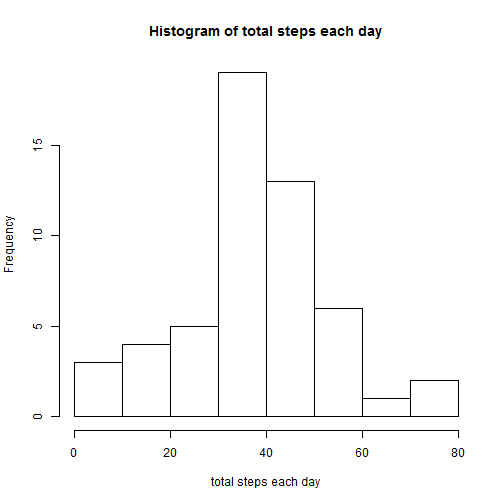
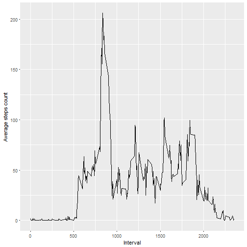
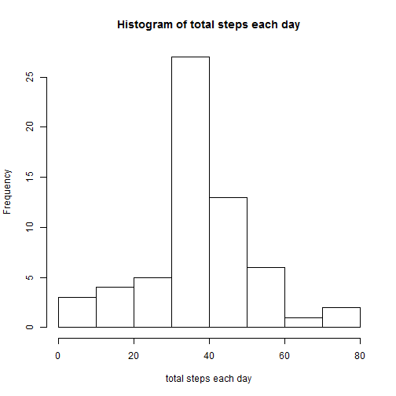
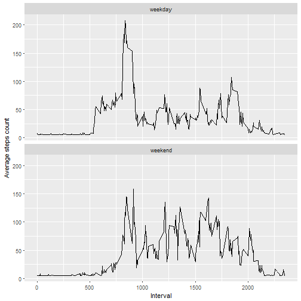

Course 5 Project 1 Assignment
====================================================================
## Read in dataset

```r
actdata <- read.csv("activity.csv")
```
## What is mean total number of steps taken per day?  

Calculate the mean

```r
date_mean <- aggregate(x=actdata$steps, by=list(actdata$date), mean,na.action = na.omit)
```
Histogram  

```r
hist(date_mean$x, main="Histogram of total steps each day", xlab="total steps each day")
```



Calculate and report the mean and median of the total number of steps taken per day  

```r
summary(date_mean$x)
```

```
##    Min. 1st Qu.  Median    Mean 3rd Qu.    Max.    NA's 
##  0.1424 30.7000 37.3800 37.3800 46.1600 73.5900       8
```
The mean of total number of steps per day is 37.3800  
The median of total number of steps per day is 37.3800  

## What is the average daily activity pattern?  
Average the steps within intervals

```r
actdata_m <- na.omit(actdata)
inter_mean <- aggregate(x=actdata_m$steps, by=list(actdata_m$interval), mean)
```
time series plot with 5 mins interval  

```r
library(ggplot2)
ggplot(inter_mean, aes(Group.1, x)) + geom_line()+xlab("Interval")+ylab("Average steps count")
```



Which 5-minute interval, on average across all the days in the dataset, contains the maximum number of steps?  

```r
inter_mean[which.max(inter_mean$x),]
```

```
##     Group.1        x
## 104     835 206.1698
```
The interval contains the max number of steps is 835  

## Imputing missing values
Calculate and report the total number of missing values in the dataset

```r
table(is.na(actdata))
```

```
## 
## FALSE  TRUE 
## 50400  2304
```
Filling in all of the missing step values with average step of the day  
If the day average is missing, fill with average over all  
Calculate the mean by day  

```r
date_mean <- aggregate(x=actdata$steps, by=list(actdata$date), mean,na.action = na.omit)
```
Calculate the mean of all  

```r
date_mean$x_a <- signif(mean(x=actdata$steps,na.rm=TRUE),0)
date_imp <- data.frame(date_mean$Group.1, with(date_mean,ifelse(is.na(x),x_a,x)))
names(date_imp) <- c("date", "step_imp")
actdata1 <- merge(x=actdata,y=date_imp,by="date")
```
Create a new dataset that is equal to the original dataset but with the missing data filled in.  

```r
actdata1$steps <- with(actdata1,ifelse(is.na(steps),step_imp,steps))
actdata1 <- actdata1[,1:3]
```
Make a histogram of the total number of steps taken each day  

```r
date_steps <- aggregate(x=actdata1$steps, by=list(actdata1$date), mean,na.action = na.omit)
names(date_steps) <- c("date","day_steps")
hist(date_steps$day_steps, main="Histogram of total steps each day", xlab="total steps each day")  
```



Mean and median total number of steps taken per day    

```r
summary(date_steps)
```

```
##          date      day_steps      
##  2012-10-01: 1   Min.   : 0.1424  
##  2012-10-02: 1   1st Qu.:34.0938  
##  2012-10-03: 1   Median :39.7847  
##  2012-10-04: 1   Mean   :37.7259  
##  2012-10-05: 1   3rd Qu.:44.4826  
##  2012-10-06: 1   Max.   :73.5903  
##  (Other)   :55
```
The mean  total number of steps taken per day is 37.7259  
The median  total number of steps taken per day is 39.7847  
## Are there differences in activity patterns between weekdays and weekends?  
Create a new factor variable in the dataset with two levels - "weekday" and "weekend"  

```r
actdata1$wk <- weekdays(as.Date(actdata1$date))
actdata1$wkday <- with(actdata1,ifelse(wk=="Sunday" | wk=="Saturday","weekend","weekday"))
```
Average steps by wkday and interval  

```r
int_steps <- aggregate(x=actdata1$steps, by=list(actdata1$wkday, actdata1$interval), mean,na.action = na.omit)
```
Time series plot with 5 mins interval  

```r
library(ggplot2)
ggplot(int_steps, aes(Group.2, x)) + facet_wrap(~Group.1,nrow=2) + geom_line()+xlab("Interval")+ylab("Average steps count")
```




